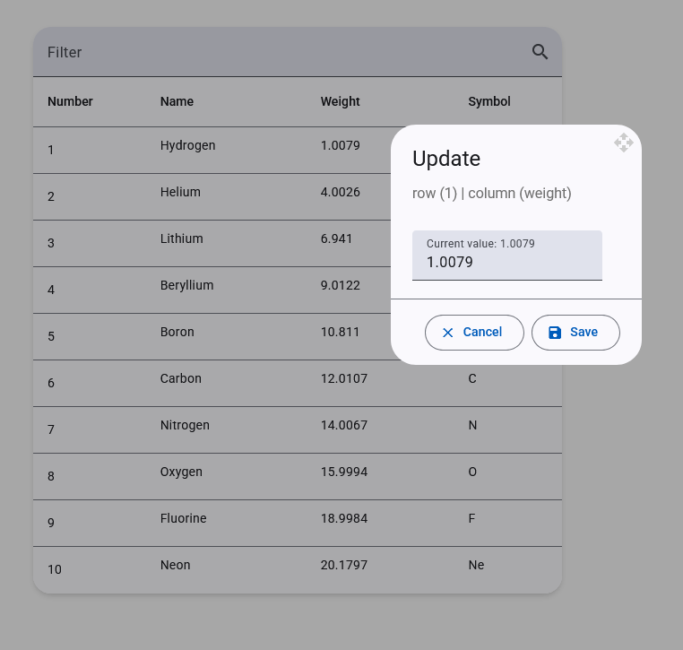

# TaskPreview - Periodic Table Viewer

This project is an interactive periodic table viewer built with Angular. It allows users to view a list of elements, filter them in real-time, and edit their properties directly in the table.



## Features

- **View Periodic Elements**: Displays a list of elements in a Material Design table.
- **Real-time Filtering**: Instantly filter elements by name, symbol, or weight.
- **Inline Editing**: Click on any cell (Name, Weight, or Symbol) to open a dialog and edit its value.
- **Reactive State Management**: Built with NgRx Signals for a modern and efficient state management solution.
- **Loading Indicator**: Shows a spinner while the initial data is being loaded.

## Technical Stack

- **Angular v20** (Standalone Components, Signals, new `@` control flow)
- **NgRx Signals** for state management (`signalStore`)
- **Angular Material** for UI components
- **TypeScript**
- **RxJS** for reactive programming

## Getting Started

### Prerequisites

- Node.js and npm/pnpm/yarn
- Angular CLI (`npm install -g @angular/cli`)

### Installation & Setup

1.  Clone the repository:
    ```bash
    git clone https://github.com/seppa89/angular-material-interactive-data-table.git
    ```
2.  Navigate to the project directory:
    ```bash
    cd angular-material-interactive-data-table
    ```
3.  Install the dependencies:
    ```bash
    npm install
    ```

### Running the Application

To start the development server, run:

```bash
npm start
```

Navigate to `http://localhost:4200/`. The application will automatically reload if you change any of the source files.
